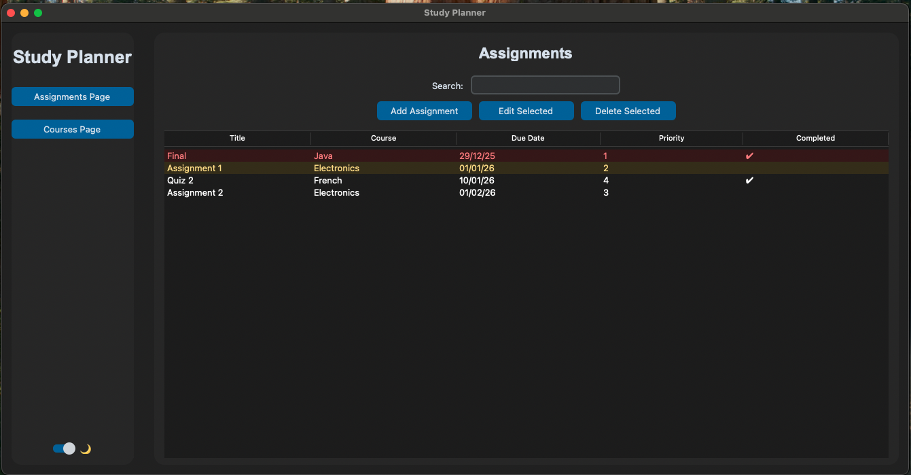

# 📘 Study Planner

A simple desktop **study planner app** built with Python and CustomTkinter.

It helps students keep track of assignments, deadlines, and priorities — with a clean UI and persistent storage.

---

## ✨ Features

- ✔️ Add, edit, delete assignments  
- ✔️ Mark assignments as completed (double-click)  
- ✔️ Search by title or course  
- ✔️ Highlight deadlines  
  - 🔴 overdue  
  - 🟡 due soon  
- ✔️ Light / Dark theme toggle  
- ✔️ SQLite database — your data is saved automatically  

More polish than a typical school project — but still lightweight and easy to run.

---

## 🛠️ Tech Stack

| Component | Purpose |
|-----------|--------|
| **Python 3** | Programming language |
| **CustomTkinter** | Modern UI framework |
| **SQLite** | Local database |
| **Tkinter Treeview** | Table display |

---

## Screenshots

